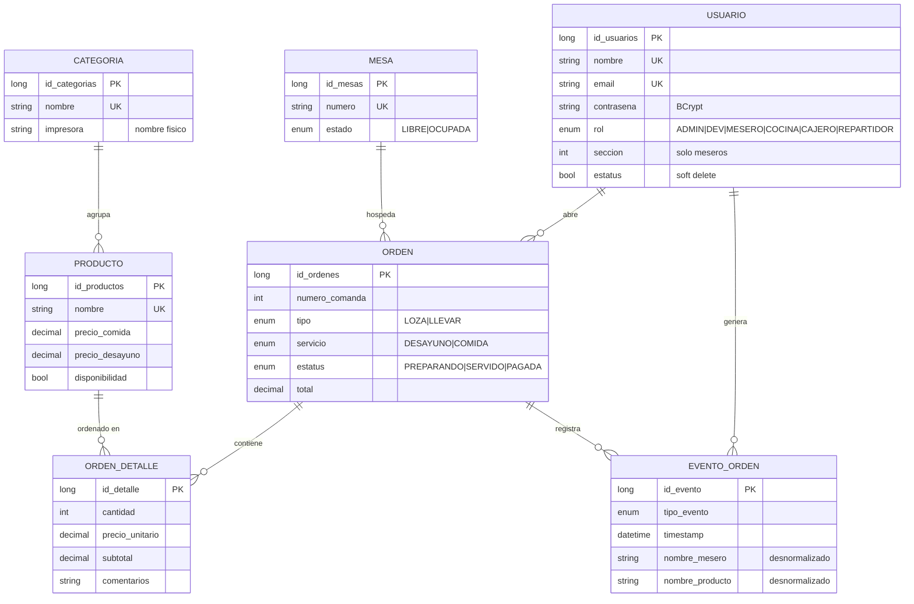
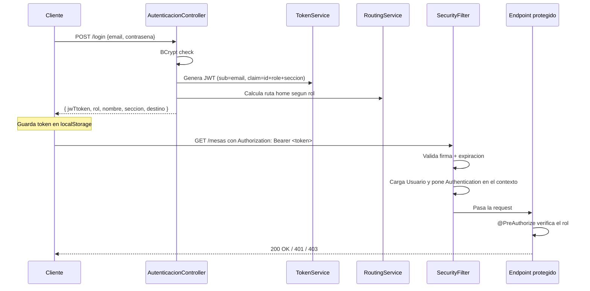

# RestFood — Backend

API REST + WebSocket que orquesta toda la operación del restaurante: meseros, cocina, caja, entregas, impresoras y reportes. Escrito en Spring Boot 3.5 sobre Java 17.

Es el cerebro del sistema. Todo lo importante (cálculos de total, validación de quién puede hacer qué, auditoría de cambios) vive aquí. El frontend es una vista bonita; este módulo es el que no puede mentir.

---

## Por qué Spring Boot

Lo elegí por tres razones concretas:

1. **Spring Security + JWT** ya resuelto como framework: no quería inventar auth desde cero siendo un sistema que maneja dinero.
2. **JPA/Hibernate** para modelar la realidad del negocio con relaciones (orden → detalles → productos → categorías) sin escribir SQL a mano.
3. **Stack que conozco y estoy aprendiendo en la escuela.** El proyecto sirve para aterrizar conceptos de 5to semestre (middleware, filtros, AOP, transaccionalidad).

La contraparte es que el binario pesa y arranca en 10+ segundos, pero eso no importa en un servidor que se enciende una vez al día.

---

## Requisitos

- **Java 17** (el proyecto usa records y `var`, no compila en 11)
- **MySQL 5.7+** (probado en 8.0)
- **Maven 3.8+**
- Una impresora térmica USB (POS-58 o compatible ESC/POS) si vas a probar impresión real

---

## Variables de entorno

Todas las variables tienen un *default* razonable para desarrollo local, excepto `JWT_SECRET` que es **obligatoria**.

| Variable | Obligatoria | Default | Para qué sirve |
|---|---|---|---|
| `JWT_SECRET` | **Sí** | — | Firma los tokens. Mínimo 32 caracteres. Si se filtra, cualquiera puede falsificar sesiones. |
| `DB_URL` | No | `jdbc:mysql://localhost:3306/restaurante?...` | Cadena JDBC de MySQL. |
| `DB_USER` | No | `root` | Usuario de BD. |
| `DB_PASSWORD` | No | `root` | Password de BD. |
| `JPA_DDL_AUTO` | No | `validate` | `validate` compara el schema con las entidades y falla si no cuadra. En dev puedes usar `update`. **Nunca `create` o `create-drop` en producción.** |
| `CORS_ORIGINS` | No | `http://localhost:5173,http://127.0.0.1:5173,http://192.168.*.*:*` | Lista separada por comas de orígenes permitidos. Aplica tanto a REST como a WebSocket. |

Ejemplo de `.env` para correr local en Linux/Mac (en Windows usa `set` o configúralo en IntelliJ/VS Code):

```bash
export JWT_SECRET="cambia-esto-por-algo-largo-y-aleatorio-min-32-chars"
export DB_URL="jdbc:mysql://localhost:3306/restaurante?createDatabaseIfNotExist=true"
export DB_USER="root"
export DB_PASSWORD="root"
export JPA_DDL_AUTO="update"
export CORS_ORIGINS="http://localhost:5173,http://127.0.0.1:5173"
```

---

## Levantarlo en desarrollo

```bash
cd RestFoodB/api
mvn spring-boot:run
```

La API queda en `http://localhost:8080`. Swagger UI en `http://localhost:8080/swagger-ui/index.html`.

Flyway aplica las migraciones automáticamente al arrancar, con `baseline-on-migrate=true` (asume que una BD vacía está en versión 0).

---

## Modelo de datos

El esquema refleja cómo funciona el negocio, no un modelo abstracto de "sistema de punto de venta":



**Por qué hay campos desnormalizados en `evento_orden`** (como `nombre_mesero`, `nombre_producto`): porque es un log histórico. Si un mesero es dado de baja o un producto se renombra, el reporte de "cancelaciones por mesero del mes pasado" debe seguir mostrando el nombre real que tenía cuando pasó el evento, no el actual. Es trade-off entre pureza del modelo y utilidad del reporte.

**Por qué las órdenes tienen dos precios (`precio_comida` y `precio_desayuno`)** y el detalle tiene su propio `precio_unitario`: el precio del turno puede cambiar de un día a otro; el detalle captura el precio en el momento de la venta. Si subes el precio del platillo mañana, no se altera el total de una orden vieja.

---

## Estructura del código

```
src/main/java/restaurante/api/
├── controller/            # HTTP endpoints (REST)
│   ├── ordenes/           # AutenticacionController, OrdenController, ...
│   └── ...
├── orden/                 # Dominio "orden": entidad, servicio, DTOs
├── mesa/                  # Dominio "mesa"
├── producto/              # Dominio "producto"
├── usuario/               # Dominio "usuario"
├── reportes/              # Corte del dia, cancelaciones
├── evento/                # Registro de EventoOrden
├── infra/
│   ├── security/          # Filtros, JWT, RoutingService, SecurityConfigurations
│   ├── websocket/         # Configuracion STOMP
│   ├── errores/           # Handler global de excepciones
│   └── impresora/         # Servicio de impresion USB/TCP-IP
└── RestFoodApiApplication.java
```

La organización es **por dominio, no por capa**. En lugar de tener `controllers/`, `services/`, `repositories/` cada uno con todo mezclado, cada paquete (orden, mesa, producto) contiene su entidad, DTOs, servicio y repositorio. Así, trabajar en órdenes significa tocar un solo paquete.

---

## Seguridad

### Flujo de autenticación



### Reglas clave

- **STATELESS**: no hay sesión de servidor. Cada request trae su token.
- **JWT con firma HMAC-SHA256**. El issuer es `RestFood API`. El subject es el email.
- **Passwords en BCrypt** (nunca en claro, nunca MD5/SHA). El campo `contrasena` tiene `@JsonIgnore` en la entidad para que no se serialice nunca por error.
- **CORS configurable** por env var. Sin wildcard en producción.
- **CSRF deshabilitado** porque la API es stateless y no usa cookies.
- **401 vs 403** diferenciado: 401 = no tienes sesión válida; 403 = tienes sesión pero no el rol requerido.
- **El `id_usuario` nunca viene del body.** El backend lo lee del `SecurityContextHolder` (quien hizo la request). Esto evita que un mesero impersone a otro pasando un `id_usuario` distinto al suyo.

### Matriz de permisos

| Área | ADMIN | DEV | MESERO | COCINA | CAJERO | REPARTIDOR |
|---|:-:|:-:|:-:|:-:|:-:|:-:|
| Login | ✔ | ✔ | ✔ | ✔ | ✔ | ✔ |
| Abrir orden (mesa) | ✔ | ✔ | ✔ | | | |
| Abrir orden (llevar) | ✔ | ✔ | | | | ✔ |
| Sincronizar platillos | ✔ | ✔ | ✔ | | | ✔ |
| Cerrar orden | ✔ | ✔ | ✔ | | ✔ | ✔ |
| Ver cocina | ✔ | ✔ | | ✔ | | |
| Marcar servido | ✔ | ✔ | | ✔ | | |
| CRUD productos | | ✔ | | | | |
| Disponibilidad del día | | ✔ | | | | ✔ |
| Gestión usuarios | ✔ | ✔ | | | | |
| Eliminar físico usuario | | ✔ | | | | |
| Corte del día / reportes | ✔ | ✔ | | | | |

El rol `CAJERO` tenía al principio permiso sobre usuarios (crear/eliminar). Se lo quité porque un cajero no debería poder crear cuentas de admin. La gestión de personal la hace solo ADMIN o DEV.

---

## Endpoints principales

### `/login` (Pública)

**POST** — email + contraseña → token + info de routing.

```json
// Request
{ "email": "mesero@rest.com", "contrasena": "1234" }

// Response
{
  "jwTtoken": "eyJhbGciOi...",
  "rol": "MESERO",
  "nombre": "Juan",
  "id_usuarios": 3,
  "seccion": 2,
  "destino": "/mesero"
}
```

El campo `destino` lo calcula `RoutingService` basado en el rol. El frontend navega directamente a esa URL sin tener que decidir nada.

### `/usuarios/me` (cualquier rol autenticado)

**GET** — devuelve los datos del usuario del token. Se usa para revalidar la sesión cada 5 minutos desde el frontend.

### `/ordendetalles` (Sincronizador — el corazón del sistema)

**POST** — recibe la comanda completa de una orden y calcula diferencias contra lo que ya está guardado.

```json
{
  "id_orden": 1,
  "platillos": [
    { "id_detalle": null, "id_producto": 5, "cantidad": 2, "comentarios": "sin cebolla" },
    { "id_detalle": 14,   "id_producto": 8, "cantidad": 1, "comentarios": null }
  ]
}
```

- `id_detalle: null` → platillo nuevo
- `id_detalle: <numero>` con cambios → platillo modificado
- detalle que existía en BD pero no viene en el payload → platillo cancelado

Cada caso dispara:
1. Registro en `evento_orden`.
2. Impresión del ticket de cocina (solo NUEVO/MODIFICADO/CANCELADO).
3. Broadcast por WebSocket a `/topic/cocina`.

`id_usuario` no se lee del body: se toma del contexto de seguridad para evitar impersonación.

### Resto de endpoints

Documentados en Swagger (`/swagger-ui/index.html`). Los grupos son:

- `/ordenes`, `/ordendetalles` — flujo de ventas.
- `/mesas` — listado y estados de mesas.
- `/cocina` — pantalla de cocina.
- `/productos`, `/categorias` — menú.
- `/usuarios` — gestión de personal.
- `/admin` — corte del día y cancelaciones.

---

## WebSocket (STOMP)

Endpoint de conexión: `ws://<host>:8080/ws-restfood` (con fallback SockJS).

El handshake requiere el JWT. Se valida en `StompChannelInterceptor` — si el token no es válido, la conexión se rechaza antes de que el cliente pueda suscribirse a nada.

### Topics

| Topic | Cuándo se emite | Quién escucha | Payload (resumen) |
|---|---|---|---|
| `/topic/mesas` | Al abrir/cerrar una orden de mesa | Panel admin, panel mesero | `{ id_mesa, estado, id_orden, nombre_mesero, platillos }` |
| `/topic/cocina` | Al sincronizar platillos o cerrar cuenta | Panel cocina | `{ numero_comanda, tipo, mesa, platillos: [{nombre, cantidad, estado, comentarios}] }` |
| `/topic/tickets` | Al cerrar una orden | Panel admin (impresión opcional) | `{ id_orden, numero_comanda, total, numeroMesa }` |

El broadcast ocurre **después** de hacer commit en la BD. Si la transacción falla, el mensaje no se emite.

---

## Impresión

`ImpresoraService` soporta dos modos:

1. **USB local** (activo): abre el device por nombre de impresora del sistema operativo.
2. **TCP/IP** (comentado, listo para activar): para impresoras de red.

Cada categoría tiene un campo `impresora` (string con el nombre del device). Así, los platillos de "Parrilla" se imprimen en la impresora de la parrilla y los de "Bebidas" en la de barra, sin que el mesero tenga que pensar en eso.

Momentos en que se dispara:

1. `POST /ordendetalles` → ticket de cocina (por cada impresora involucrada).
2. `PUT /ordenes/{id}/cerrar` → ticket del cliente.
3. `POST /ordenes/{id}/reimprimir-ticket` → reimprime el ticket del cliente.
4. `POST /ordenes/{id}/reenviar-cocina` → reenvía la comanda completa marcada como REENVIO.

---

## Manejo de errores

`TratadorDeErrores` intercepta globalmente:

| Excepción | HTTP | Cuándo |
|---|---|---|
| `ValidacionException` | 400 | Regla de negocio rota (e.g. "mesa ya está ocupada", "categoría llena") |
| `RecursoNoEncontradoException` | 404 | Entidad no existe |
| `MethodArgumentNotValidException` | 400 | Bean Validation falla en el DTO |
| `BadCredentialsException` | 401 | Login incorrecto |
| `AccessDeniedException` | 403 | Rol insuficiente |
| Otras | 500 | Error interno, mensaje genérico (sin stack) |

Respuesta estandarizada:

```json
{ "mensaje": "Descripcion del error", "ruta": "/ordenes/99/cerrar" }
```

**En 500 nunca se expone el mensaje de la excepción original** para no filtrar info de infraestructura (nombres de columnas, stack traces). Solo se loggea server-side.

---

## Decisiones que podrías cuestionar

**¿Por qué no usas DDD estricto / CQRS / event sourcing?** Porque es un sistema para un restaurante de un pueblo, no un banco. Over-engineering aquí es peor que la deuda técnica.

**¿Por qué no hay tests unitarios todavía?** Honestamente porque estaba priorizando que funcione para desplegar. Es lo primero que voy a agregar en la v2.

**¿Por qué MySQL y no Postgres?** Porque es lo que está instalado en las PCs del restaurante y lo que conozco. Postgres sería técnicamente mejor para reportes complejos.

**¿Por qué Flyway en `validate` por defecto?** Porque `update` deja que Hibernate altere el schema silenciosamente; eso está bien en dev pero en producción quieres que cada cambio de schema pase por una migración versionada.

---

## Despliegue (cheat sheet)

1. `mvn clean package` → genera `target/api-0.0.1-SNAPSHOT.jar`.
2. Copia el jar al servidor.
3. Configura variables de entorno (JWT_SECRET real, DB_URL con IP del MySQL, CORS_ORIGINS con la IP del frontend).
4. Arráncalo con `java -jar api.jar` o como servicio (systemd / NSSM en Windows).
5. Verifica que `curl http://localhost:8080/swagger-ui/index.html` responda 200.
6. Verifica que `POST /login` funcione con un usuario real.

Si algo falla, los logs están en `logs/` (configurable en `application.properties`).

---

## Problemas comunes

| Síntoma | Causa probable | Solución |
|---|---|---|
| `Communications link failure` al arrancar | MySQL no está corriendo o `DB_URL` apunta mal | Verifica `systemctl status mysql` o `services.msc` |
| `JWT secret is too short` | `JWT_SECRET` < 32 chars | Usa `openssl rand -base64 48` |
| CORS bloqueado en el browser | Origen del frontend no está en `CORS_ORIGINS` | Agrégalo a la variable y reinicia |
| Impresora no responde | Device name mal escrito en la categoría | Verifica el nombre exacto en "Impresoras del sistema" |
| WebSocket se desconecta constantemente | Token expiró o fue revocado | El frontend debería reconectar solo; si no, revisar `websocketService.js` |
| 401 en `/usuarios/me` inmediato | El token en localStorage es viejo y `JWT_SECRET` cambió | Logout + login. Los tokens firmados con el secret anterior ya no valen |
